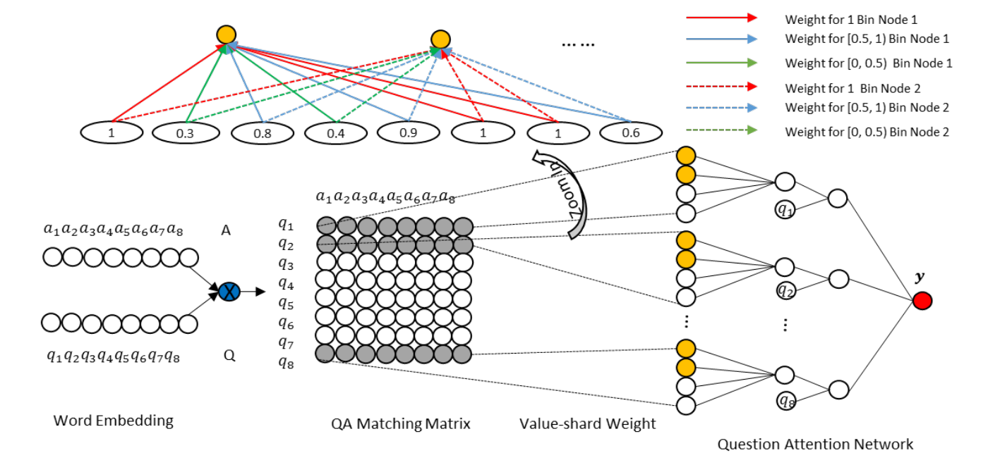

# Documental Semantic Similarity Scoring and Ranking
* project description:
    This NLP project is funded by Dubai Electricity & Water Authority (DEWA) Company. I participated into it as a summber intern in 2018.   This project aims to filter out duplicate and similar comments and ideas (written in English) in terms of semantics in the Idea Management System. Due to confidentiality agreement, the original dataset will not be accessible here. However, the implemented model is suitable for related text similarity scoring application. 
* purpose of project
    To save manpower of human, the duplicated comments (mostly operational suggestions for company improvements). Some of submitted comments are not even form suggestions grammatially or contextually and some suggestions are very similar to each other or have been evaluated before by human operator before (calling by the term 'duplicate comments' here). These document/text are the ones we do not want to spend time looking at again. Therefore, an automatic text filtering system is needed in place to alleviate human workload and to do the duplicate comment detection and delettion for us. The filtered documents will be looked and evaluted by human but the total amount of documents would be drastically reduced after passing through this designed system.
* Model
    The model in this Gittub is a simple  machine learning model to score two domain-specfic documents in terms of semantic similarity. 
* Data    
     A example of input documents is given below:
     "
     display dewa advertisements on the mirrors of the restrooms in all customer service centers. display dewa advertisements on the mirrors of the restrooms in all customer service centers. we need to increase our methods of sending our product knowledge to our customers in dewa. how. as a method that being used in some restrooms in cinemas and other places as well. why not display dewa advertisements on the mirrors of the restrooms in all customer service centers. these advertisements will be displayed on the mirrors thru led display which appears and disappears.
     <p style='color:blue'>"HR needs to prepare a detailed program, obtain MD&CEO approval and submit necessary documents to FD, e.g. copy of the new born baby's passport / birth certificate showing the names of parents, for payment through the payroll."</p>
     
     <b>Due to confidentiality agreement, the original dataset will not be accessible here. </b>


## Challenge
1. <b>Domain-Specfic Context.</b> Some terms in the comments are domain specfic, which requires re-training the pretrained word embedding.
2. <b>Noisy inputs.</b> Human lanaguge mistakes including speall errors, ungramatical sentences, misused punctuations, etc.
3. <b>Lots of acronyms in the text.</b> Detecting and expanding acroyms 
are needed
4. <b>Small Size Dataset.</b> Fully relying on deep learning might not be wise, some rules should be added to asist for filtering.

## Acronym Detection
The notebook to detect and store acronym dictionary is [nootbook](preprocess/acronym.ipynb). The corpus (dewanews.json) is piplined from company related websites to cover more related context and explore more acronyms. The REGEX libary is used to extract the terms. The regular expression to extract a form of acronym and its full expanding expression, e.g., "Human Resourse (HR)" is: 
</b> "re.findall(r'\b(([A-Z]{1,}[_a-z0-9]+ *){1,}[for|by|to|of|and]* *([A-Z]{1,}[_a-z0-9]+ *){1,}\([A-Za-z]+\))',k)"</b> 
The resulted acronym list is stored for text preprocessing.

##Preproces
Preprocessing is in the notebook: [dewa_processing.ipynb](preprocess/dewa_processing.ipynb) . The preprocessing follows the steps below:
1.  Convert into ASCII. Some words in Arabic and the model deals with vocab by default in English.
2.  Special character processing. 
3.  Convert number into string
4.  Deal with Misplaced punctuation. A common example is mutiple period, for example.
5.  Replace acronym with its full English expression.
6.  Trimming the text. For example, converting "he s strong" into "he is strong" and other minor adjustments.


## Model
Two experimental models are implemented in Pytorch by me during the intern period.
All the model uses pre-trained word embeddings to identify semantic similarities.
* LSTM Siamese network. It uses a multilayer siamese LSTM network and euclidian distance based contrastive loss to learn input pair similairty. The original paper could be found in this link: [http://www.mit.edu/~jonasm/info/MuellerThyagarajan_AAAI16.pdf](http://www.mit.edu/~jonasm/info/MuellerThyagarajan_AAAI16.pdf)

- Phrase similarity using char level embeddings [1]


- Sentence similarity using word level embeddings [2]


My implementation is done in <b>PyTorch</b> and store in the ：“lstm_siamese” folder.

To run the model:
```
python train.py 

```

* Attention based Nerual Network
The model is from the paper: [aNMM: Ranking Short Answer Texts with Attention-Based Neural Matching Model](http://maroo.cs.umass.edu/pub/web/getpdf.php?id=1240/)

A model architecture is shown:


Note: A distinct characteristic of this aNMM model is that it employs a value-shared weight scheme in each layer instead of the commonly used position shared weight scheme. That is to say, similar value node input will be assigned with same weight. A wise implementation of it is to partition inputs to bins and then assign weights to them, the partitioned file is stored in txt file ending with .binsum.

Config model in classificition mode: config anmm_classify.config
Config model in ranking mode: config anmm_ranking.config
To prepare the corpus and prepare the training:
```
chmod +x run_data.sh
./run_data.sh

```

To run the model:
```

python train.py 

```
<b> Note:this aNMM model is tested on QuraQP corpus. </b>

## Ranking
+ **corpus.txt**: Each line is corresponding to a document. The first column is document ID. Then the following words are from this document after tokenization.

+ **corpus_preprocessed.txt**: Each line is corresponding to a document. The first column is document id. The second column is the document length, followed by the ids of words in this document.

+ **relation_train.txt/relation_valid.txt/relation_test.txt**: Each line is "label query_id doc_id", which could be used for experiments including document retrieval, passage retrieval, answer sentence selection, etc. For each query, the documents are sorted by the labels. These labels can be binary or multi-graded.

+ **sample.txt**: Each line is the raw query and raw document text of a document. The format is "label \t query \t document_txt".

+ **word_dict.txt**: The word dictionary. Each line is the word and word_id.


## References
1. [Learning Text Similarity with Siamese Recurrent Networks](http://www.aclweb.org/anthology/W16-16#page=162)
2. [Siamese Recurrent Architectures for Learning Sentence Similarity](http://www.mit.edu/~jonasm/info/MuellerThyagarajan_AAAI16.pdf)

